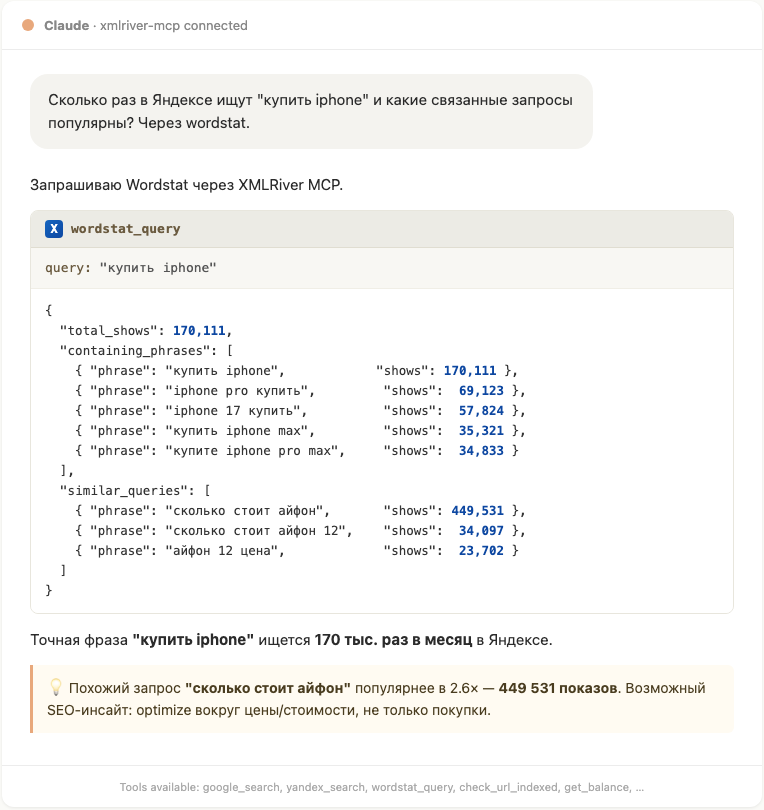

<p align="center">
  
</p>

# `xmlriver-mcp`

> MCP server for [XMLRiver](https://xmlriver.com) — Google/Yandex SERP parsing and Yandex Wordstat keyword frequency data via XML API.

mcp-name: io.github.artgas1/xmlriver-mcp

[](cursor://anysphere.cursor-deeplink/mcp/install?name=xmlriver&config=eyJjb21tYW5kIjoidXZ4IiwiYXJncyI6WyJ4bWxyaXZlci1tY3AiXSwiZW52Ijp7IlhNTFJJVkVSX1VTRVIiOiI8eW91cl91c2VyX2lkPiIsIlhNTFJJVkVSX0tFWSI6Ijx5b3VyX2FwaV9rZXk+In19)
[](https://vscode.dev/redirect?url=vscode%3Amcp%2Finstall%3F%7B%22command%22%3A%22uvx%22%2C%22args%22%3A%5B%22xmlriver-mcp%22%5D%2C%22env%22%3A%7B%22XMLRIVER_USER%22%3A%22%3Cyour_user_id%3E%22%2C%22XMLRIVER_KEY%22%3A%22%3Cyour_api_key%3E%22%7D%7D)
[](https://claude.ai/download)

[](https://pypi.org/project/xmlriver-mcp/)
[](https://pepy.tech/project/xmlriver-mcp)
[](LICENSE)
[](https://www.python.org/downloads/)

## What it does

Gives Claude / Cursor / Windsurf direct access to:

- **Google SERP** parsing (organic, ads, FAQ, knowledge graph, AI Overview) for any country / region / device
- **Yandex SERP** parsing (Russian-speaking markets — primary use case)
- **Yandex Wordstat** keyword frequency, history, similar queries (Yandex's keyword volume tool)
- **Indexing check** — is this URL in Google/Yandex index?
- **Account ops** — balance, tariff, cost per 1k requests

**First MCP** for XMLRiver — fills a gap for Russian SEO research and Yandex-aware analysis. Pay-as-you-go (~25 ₽ / 1000 requests on Basic tariff).

## Demo

<p align="center">
  
</p>

Claude queries `wordstat_query` and parses real frequency data from Yandex. Same flow works for `google_search`, `yandex_search`, indexing checks, and account ops.

## Quickstart

```bash
uvx xmlriver-mcp
```

## Configuration

### Claude Desktop

Edit `~/Library/Application Support/Claude/claude_desktop_config.json` (macOS) or `%APPDATA%\Claude\claude_desktop_config.json` (Windows):

```json
{
  "mcpServers": {
    "xmlriver": {
      "command": "uvx",
      "args": ["xmlriver-mcp"],
      "env": {
        "XMLRIVER_USER": "<your_numeric_user_id>",
        "XMLRIVER_KEY": "<your_40_char_hex_key>"
      }
    }
  }
}
```

### Claude Code

Add to project `.mcp.json`:

```json
{
  "mcpServers": {
    "xmlriver": {
      "command": "uvx",
      "args": ["xmlriver-mcp"],
      "env": {
        "XMLRIVER_USER": "<your_numeric_user_id>",
        "XMLRIVER_KEY": "<your_40_char_hex_key>"
      }
    }
  }
}
```

### Cursor

Edit `~/.cursor/mcp.json` (global) or `.cursor/mcp.json` (project):

```json
{
  "mcpServers": {
    "xmlriver": {
      "command": "uvx",
      "args": ["xmlriver-mcp"],
      "env": {
        "XMLRIVER_USER": "<your_numeric_user_id>",
        "XMLRIVER_KEY": "<your_40_char_hex_key>"
      }
    }
  }
}
```

## Tools

| Tool | What it does |
|---|---|
| `google_search` | Parse Google SERP for a query — country, language, device, page, date filter, extra blocks (ads, FAQ, knowledge graph, AI Overview) |
| `yandex_search` | Parse Yandex SERP — region, language, device, page, date filter, extra blocks |
| `yandex_search_api_v2` | Yandex Search API v2 (official) via XMLRiver — cleaner structured output |
| `wordstat_query` | Yandex Wordstat keyword frequency, device breakdown, history, similar queries |
| `check_url_indexed` | Check if URL is indexed in Google or Yandex |
| `get_balance` | Current XMLRiver balance in rubles |
| `get_tariff` | Current XMLRiver tariff name (Basic / Pro / Mega / Giga) |
| `get_tariff_expire` | Tariff expiration date (for prepay tariffs) |
| `get_cost` | Cost per 1000 requests for a given engine (google / yandex / yaxml / wordstat) |

All tools are **read-only** (annotated with `readOnlyHint: true`). No destructive operations.

## Authentication

1. Register at https://xmlriver.com
2. Top up balance (minimum ~100 ₽ to start)
3. Get your `user` (numeric ID) and `key` (40-char hex) from the dashboard
4. Set `XMLRIVER_USER` and `XMLRIVER_KEY` env vars in your MCP client config

**Security note:** XMLRiver API is HTTP-only (not HTTPS). The key is rotatable from the dashboard if compromised.

## Pricing context

| Tariff | Setup | Google / Yandex / Wordstat | Yandex Search API v2 |
|---|---|---|---|
| **Basic** | Pay-as-you-go | 25 ₽ / 1k | 25 ₽ / 1k |
| Pro | 5000 ₽/mo | 20 ₽ / 1k | 24 ₽ / 1k |
| Mega | 15000 ₽/mo | 15 ₽ / 1k | 23 ₽ / 1k |
| Giga | 50000 ₽/mo | 12 ₽ / 1k | 22 ₽ / 1k |

Use `get_balance` and `get_cost` to monitor spend before bulk operations.

## Common use cases

- **SEO position tracking** — `yandex_search(query="...", region=213)` for own/competitor ranking
- **Keyword research** — `wordstat_query(query="купить iphone", history_period="monthly")` for demand validation + seasonality
- **Featured snippet hunting** — `google_search(additional_blocks="faqsnippet,knowledge_graph,zeroposition")` to see what owns the answer box
- **Indexation monitoring** — `check_url_indexed(url="https://your-site.com/new-page")` after publishing
- **Cross-region comparison** — same query, different `region`/`country` for Yandex/Google to see geographic variance

## Local development

```bash
git clone https://github.com/artgas1/xmlriver-mcp
cd xmlriver-mcp
uv sync --all-extras

# Run unit tests (no API key needed)
uv run pytest tests/unit -v

# Run integration tests (requires XMLRIVER_USER / XMLRIVER_KEY)
XMLRIVER_USER=... XMLRIVER_KEY=... uv run pytest tests/integration -v -m integration

# MCP Inspector — interactive
XMLRIVER_USER=... XMLRIVER_KEY=... npx @modelcontextprotocol/inspector uv run python -m xmlriver_mcp.server

# MCP Inspector — CLI smoke test (list tools)
npx @modelcontextprotocol/inspector --cli "uv run python -m xmlriver_mcp.server" --method tools/list
```

## Architecture

- **Stack:** Python 3.10+ / [FastMCP](https://github.com/jlowin/fastmcp) / httpx / tenacity / pydantic
- **Transport:** stdio (default)
- **No external SDK dependency** — direct REST via httpx + custom XML parser
- **Retry strategy:** 3 attempts with exponential backoff on network errors (not on HTTP 4xx)
- **Logging:** stderr only (stdio protocol requires stdout for JSON-RPC)

## License

[MIT](LICENSE)

## Contributing

PRs welcome. Open an issue first for substantial changes.

## Acknowledgements

- [XMLRiver](https://xmlriver.com) — for the underlying API
- [Anthropic MCP](https://modelcontextprotocol.io) — for the protocol
